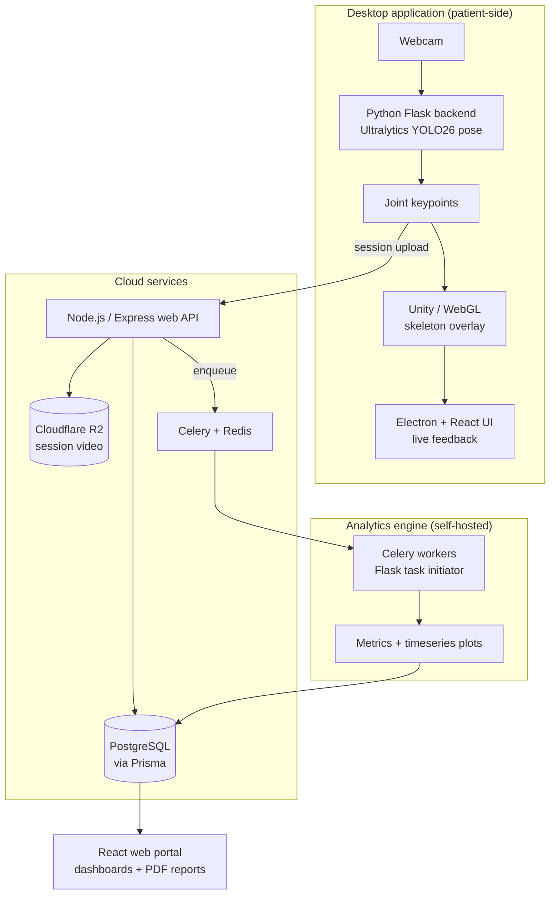

# PhysioLens

**A data-driven exercise analysis platform for patients recovering from sports-related
injuries and the clinicians guiding their recovery.**

[**▶ Watch the demo**](https://youtu.be/ObZUk4tqyTE) &nbsp;·&nbsp;
[**Project page**](https://setprojectday.ca/post/2026/physiolens/)

PhysioLens covers the full rehabilitation workflow. A desktop application uses an
ordinary webcam to track a patient through prescribed exercises, computing joint
kinematics in real time with no markers or wearables. A web portal then gives
clinicians remote visibility into every session — objective metrics, timeseries
plots, and generated reports instead of self-reported guesswork between appointments.

Built as a capstone project for the Software Engineering Technology program at
Conestoga College, 2026.

---

## Demo

---

## What it does

**For patients**

- Markerless webcam tracking — no sensors, no suits, no special hardware
- Live skeleton overlay with real-time form feedback during the set
- Five core lifts supported: squat, deadlift, barbell row, push-up, overhead press
- Free-form mode for any movement a clinician wants to prescribe
- Instant post-set feedback with plain-language explanations
- Per-set notes back to the clinician

**For clinicians**

- Asynchronous review of any past session, with full video playback
- Multi-patient monitoring dashboards
- Customizable visualizations of joint position, angle, velocity, and acceleration over time
- Generated PDF reports with session metrics and timeseries plots
- Custom routine assignment
- Centralized patient notes

---

## What it measures

Pose keypoints are only the raw material. The analytics engine derives clinically
meaningful metrics from them:

| Metric | What it captures |
|---|---|
| Joint angle thresholds | Whether each rep reached the prescribed depth or lockout |
| Range of motion per rep | Consistency of movement amplitude across a set |
| Center of mass drift | Balance and stability through the lift |
| Angular velocity loss | Fatigue accumulating within a set |
| Rep consistency | Variation between reps that a patient can't self-observe |
| Movement smoothness (SPARC) | Spectral arc length — jerkiness as a proxy for motor control |
| Action summary score (NCC + DTW) | Similarity to a reference movement via normalized cross-correlation and dynamic time warping |

Faults are surfaced per rep with the measured value, the target, and why it matters —
for example, excessive forward lean reported as a measured torso angle against a
threshold, with the associated lower-back risk explained in the patient's language.

---

## Architecture

The split between live and deferred processing is the central design decision. Pose
inference runs locally on the patient's machine so feedback appears during the set
rather than after it, and so raw video never has to leave the device to produce a
skeleton. The heavier derived analytics — smoothness, correlation scoring, plot
generation — are queued to Celery workers instead, where a slow job costs nobody a
frozen UI and processing scales independently of the web tier.

---

## Repositories

| Repository | What's inside |
|---|---|
| [**Client-App**](https://github.com/PhysioLens/Client-App) | Cross-platform Electron desktop app. Three-layer architecture: Electron main process, React/Vite renderer, and a Python Flask backend packaged with PyInstaller. Handles capture and live inference. |
| [**Cloud-Services**](https://github.com/PhysioLens/Cloud-Services) | The web tier — an Express API (`web-api`) with Prisma and AWS-backed auth, and the React clinician portal (`web-portal`). |
| [**Post-Processing**](https://github.com/PhysioLens/Post-Processing) | The analytics engine. Flask task initiator, Celery workers, Redis broker, and Flower for worker monitoring, orchestrated with Docker Compose. Contains the kinematics modules — angle calculation, phase detection, SPARC, center of mass, smoothing, plotting. |
| [**Skeleton**](https://github.com/PhysioLens/Skeleton) | Unity project for the WebGL skeleton overlay rendered in the desktop app. |

---

## Tech stack

**Desktop application** — Electron, React, TypeScript, Vite, Tailwind, Electron Forge,
Python, Flask, Ultralytics YOLO26 pose, PyInstaller, uv

**Skeleton visualization** — Unity, WebGL

**Web portal** — React, Vite, Node.js, Express, Prisma, PostgreSQL, AWS, Cloudflare R2

**Analytics engine** — Python, Flask, Celery, Redis, Flower, Docker Compose

---

## Team

PhysioLens was built by four developers over the 2026 capstone term.

| | Focus |
|---|---|
| **Nick Aguilar** | Cloud services and data analytics. Project management and systems design; built the web portal frontend and backend API, deployed the cloud infrastructure, and developed the biomechanical analytics algorithms. |
| **Francis Knowles** | Vision engine and data analytics. Led the client-app backend and kinematic analysis engine, focused on extracting and analyzing data from the YOLO model. |
| **Nathan Joannette** | WebGL skeleton and web portal UI. Led the Unity skeleton overlay and contributed to the portal. |
| **Alex Simko** | Electron application and UI/UX. Led the desktop application shell and the user experience across all clients. |

---

## Status

Complete as a capstone deliverable. the repositories are
public for reference rather than under active development.
